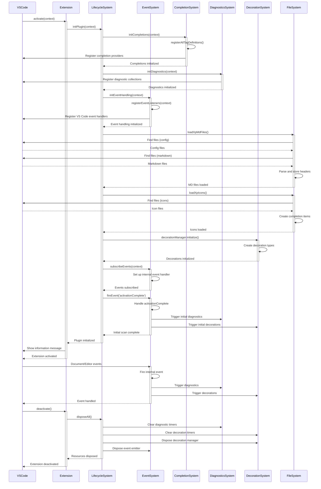
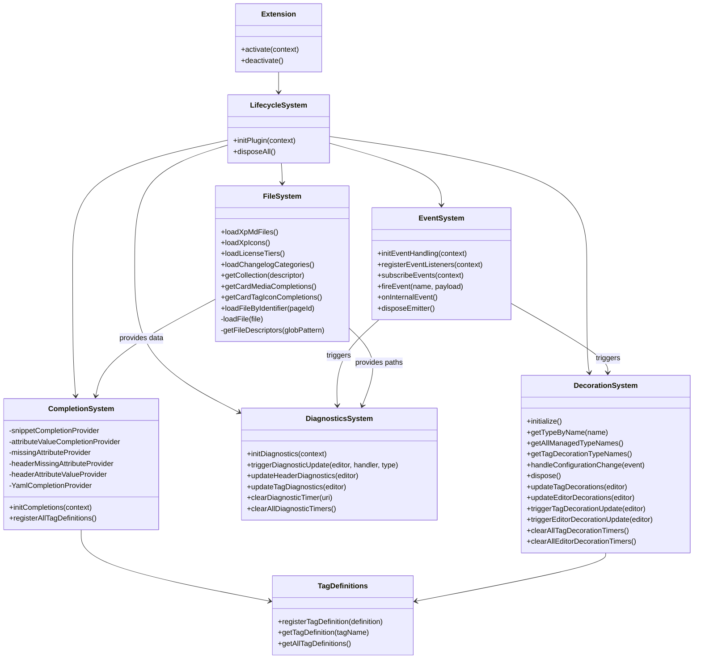

# Kentico Docs VSCode Extension Lifecycle

This document explains the component lifecycle and architecture of the Kentico docs autocomplete VS Code extension. The diagrams below were generated using Mermaid.js.

## Extension Lifecycle Flow

The following diagram illustrates the initialization and shutdown flow of the extension components:

```mermaid
flowchart TD
    %% Main extension lifecycle components
    activate[Extension activation]
    deactivate[Extension deactivation]
    
    %% Core initialization
    initPlugin[initPlugin]
    disposeAll[disposeAll]
    
    %% Main system components
    initCompletions[initCompletions]
    initDiagnostics[initDiagnostics]
    initEventHandling[initEventHandling]
    loadFiles[Load Workspace Files]
    decorationInit[decorationManager.initialize]
    subscribeEvents[subscribeEvents]
    fireActivationComplete[Fire 'activationComplete' event]
    
    %% File loading components
    loadXpMdFiles[loadXpMdFiles]
    loadXpIcons[loadXpIcons]
    
    %% Event system
    registerListeners[registerEventListeners]
    vs_listeners[VS Code Event Listeners]
    internalEvents[Internal Event System]
    
    %% Completions system
    regTagDefinitions[registerAllTagDefinitions]
    completionProviders[Register Completion Providers]
    
    %% Diagnostics system
    diagnosticCollections[Register Diagnostic Collections]
    
    %% Event handler execution - happens when events fire
    eventListeners[Event Listeners]
    diagnosticUpdates[Trigger Diagnostic Updates]
    tagDecorationUpdates[Trigger Tag Decoration Updates]
    editorDecorationUpdates[Trigger Editor Decoration Updates]
    
    %% Activation flow
    activate --> initPlugin
    initPlugin --> initCompletions
    initPlugin --> initDiagnostics
    initPlugin --> initEventHandling
    initPlugin --> loadFiles
    initPlugin --> decorationInit
    initPlugin --> subscribeEvents
    initPlugin --> fireActivationComplete
    
    %% File loading
    loadFiles --> loadXpMdFiles
    loadFiles --> loadXpIcons
    
    %% Event system initialization
    initEventHandling --> registerListeners
    registerListeners --> vs_listeners
    
    %% Completion system initialization
    initCompletions --> regTagDefinitions
    initCompletions --> completionProviders
    
    %% Diagnostics initialization
    initDiagnostics --> diagnosticCollections
    
    %% Event subscription and handling
    subscribeEvents --> internalEvents
    
    %% Event processing flow
    vs_listeners -.->|fires| internalEvents
    internalEvents -.->|handles| eventListeners
    eventListeners -.->|triggers| diagnosticUpdates
    eventListeners -.->|triggers| tagDecorationUpdates
    eventListeners -.->|triggers| editorDecorationUpdates
    
    %% Activation event - special case
    fireActivationComplete -.->|triggers initial scan| eventListeners
    
    %% Deactivation flow
    deactivate --> disposeAll
    disposeAll --> clearDiagnosticTimers[Clear Diagnostic Timers]
    disposeAll --> clearTagDecorationTimers[Clear Tag Decoration Timers]
    disposeAll --> clearEditorDecorationTimers[Clear Editor Decoration Timers]
    disposeAll --> decorationManagerDispose[Dispose Decoration Manager]
    disposeAll --> disposeEmitter[Dispose Event Emitter]
    
    %% Styling
    classDef mainFlow fill:#f9f,stroke:#333,stroke-width:2px
    classDef eventSystem fill:#bbf,stroke:#33b,stroke-width:1px
    classDef fileSystem fill:#bfb,stroke:#3b3,stroke-width:1px
    classDef decorations fill:#fbb,stroke:#b33,stroke-width:1px
    classDef completions fill:#ffb,stroke:#bb3,stroke-width:1px
    classDef diagnostics fill:#bff,stroke:#3bb,stroke-width:1px
    
    class activate,deactivate,initPlugin,disposeAll mainFlow
    class initEventHandling,registerListeners,vs_listeners,internalEvents,subscribeEvents,eventListeners,fireActivationComplete eventSystem
    class loadFiles,loadXpMdFiles,loadXpIcons fileSystem
    class decorationInit,tagDecorationUpdates,editorDecorationUpdates,decorationManagerDispose,clearTagDecorationTimers,clearEditorDecorationTimers decorations
    class initCompletions,regTagDefinitions,completionProviders completions
    class initDiagnostics,diagnosticCollections,diagnosticUpdates,clearDiagnosticTimers diagnostics
```

## Sequence Diagram

This diagram shows the initialization sequence and event flow between components:

## Component Class Diagram

This diagram shows the main components and their relationships:

## Component Descriptions

### Extension Core
- **Extension**: The main entry point with `activate` and `deactivate` functions
- **LifecycleSystem**: Manages initialization and dispose sequences

### Key Subsystems
- **EventSystem**: Bridges VS Code events to internal components using a custom event emitter
- **CompletionSystem**: Provides IntelliSense for tags, attributes, and YAML frontmatter
- **DiagnosticsSystem**: Validates markdown content and shows errors/warnings
- **DecorationSystem**: Manages text decorations for markdown elements
- **FileSystem**: Loads and parses workspace files and icons

### Event Flow
1. VS Code events are captured by registered listeners
2. Internal events are fired via the EventSystem
3. Event handlers trigger diagnostics and decorations updates as needed

### Key Features
- Debounced updates for good performance
- Event-driven architecture
- Comprehensive initialization and cleanup
